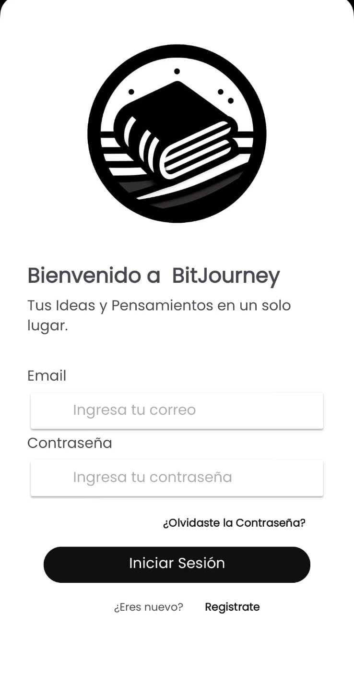
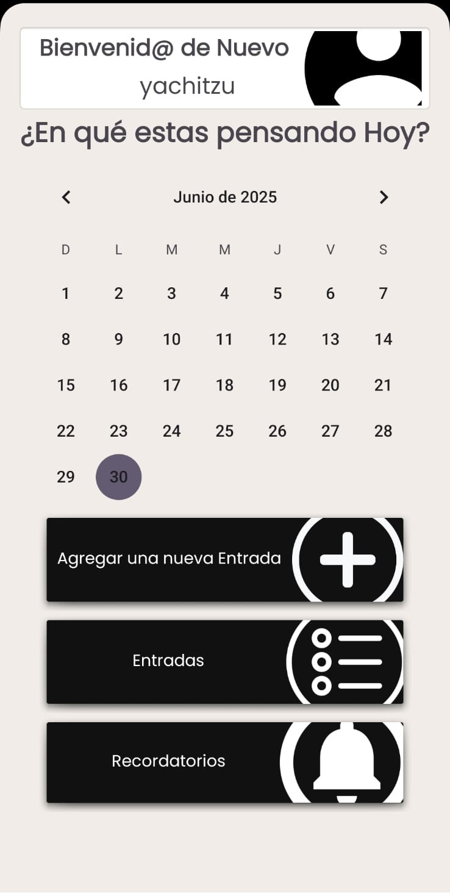

# 📔 BitJourney

**BitJourney** es una aplicación móvil diseñada para permitir a los usuarios documentar y reflexionar sobre sus experiencias diarias de una manera fácil, rápida y segura. La app proporciona un espacio digital personal donde los usuarios pueden registrar pensamientos, emociones y eventos significativos, con herramientas para organizar y acceder fácilmente a sus entradas.

---

## 🎯 Objetivos

- Permitir a los usuarios documentar sus experiencias cotidianas de forma sencilla.
- Ofrecer una estructura organizativa eficiente mediante etiquetas y fechas.
- Facilitar la búsqueda y recuperación de entradas pasadas.
- Fomentar la escritura diaria mediante recordatorios personalizados.

---

## 🧩 Funcionalidades Principales

### ✅ Registro de Usuario
- Creación de cuenta mediante correo y contraseña.
- Inicio de sesión seguro con autenticación por Firebase.

### 📝 Creación de Entradas
- Entradas con texto enriquecido.
- Posibilidad de adjuntar imágenes y archivos.
- Editor intuitivo y adaptable.

### 🗂 Organización y Categorización
- Organización por fecha o etiquetas personalizadas.
- Sistema de búsqueda integrado para localizar entradas fácilmente.

### ⏰ Recordatorios
- Configuración de notificaciones para mantener el hábito de escritura.

---

## 🛠 Tecnologías Utilizadas

| Componente   | Herramienta / Tecnología       |
|--------------|-------------------------------|
| Frontend     | Android SDK                    |
| Backend      | Java                           |
| Base de datos y Auth | Firebase (Firestore y Authentication) |

---

## 📱 Capturas de Pantalla

## 📱 Capturas de Pantalla

A continuación se presentan algunas pantallas clave de **BitJourney**:

<table>
  <tr>
    <td align="center"><b>Pantalla de carga</b></td>
    <td align="center"><b>Registro de usuario</b></td>
  </tr>
  <tr>
    <td></td>
    <td></td>
  </tr>
  <tr>
    <td align="center"><b>Login</b></td>
    <td align="center"><b>Página principal</b></td>
  </tr>
  <tr>
    <td></td>
    <td></td>
  </tr>
</table>


---

## 🚀 Instalación y Ejecución

> Requisitos:
- Android Studio instalado
- Cuenta Firebase configurada

## Clona el repositorio:
   ```bash
   git clone https://github.com/Yachitzu/BitJourney.git
